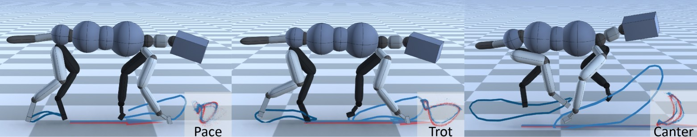

SIGGRAPH 2020<br/>
CARL: Controllable Agent with Reinforcement Learning for Quadruped Locomotion<br >
<sub>Ying-Sheng Luo*, Jonathan Hans Soeseno*, Trista Pei-Chun Chen, Wei-Chao Chen </sub><br /><sub><sup>(*Joint First Authors)</sup><sub>
------------



Motion synthesis in a dynamic environment has been a long-standing problem for character animation. Methods using motion capture data tend to scale poorly in complex environments because of their larger capturing and labeling requirement. Physics-based controllers are effective in this regard, albeit less controllable. In this paper, we present CARL, a quadruped agent that can be controlled with high-level directives and react naturally to dynamic environments. Starting with an agent that can imitate individual animation clips, we use Generative Adversarial Networks to adapt high-level controls, such as speed and heading, to action distributions that correspond to the original animations. Further fine-tuning through the deep reinforcement learning enables the agent to recover from unseen external perturbations while producing smooth transitions. It then becomes straightforward to create autonomous agents in dynamic environments by adding navigation modules over the entire process. We evaluate our approach by measuring the agent's ability to follow user control and provide a visual analysis of the generated motion to show its effectiveness.

Project page: https://inventec-ai-center.github.io/projects/CARL/index.html<br >
Youtube: https://youtu.be/t9CdF_Pl19Q<br >
Paper: https://arxiv.org/abs/2005.03288


# Installation

## Linux (recommended: Ubuntu 18.04)

1. Install dependencies
``` bash
sudo apt-get update
sudo apt-get install -y vim cmake wget git tar unzip build-essential clang llvm python-dev freeglut3-dev libglew-dev swig libopenmpi-dev python3-pip
```

2. Clone the repository
```bash
git clone --recursive https://github.com/inventec-ai-center/carl-siggraph2020.git
```

3. Install [Eigen](http://eigen.tuxfamily.org/index.php) (version: 3.3.7)
``` bash
cd /
wget https://gitlab.com/libeigen/eigen/-/archive/3.3.7/eigen-3.3.7.tar.bz2
tar -xf eigen-3.3.7.tar.bz2
cd eigen-3.3.7
mkdir build_cmake
cd build_cmake
cmake ..
sudo make install
```

4. Install [Bullet](https://github.com/bulletphysics/bullet3) (version: 2.88)
``` bash
cd /
wget https://github.com/bulletphysics/bullet3/archive/2.88.zip
unzip 2.88.zip
cd bullet3-2.88/
vim build_cmake_pybullet_double.sh
# replace -DUSE_DOUBLE_PRECISION=ON with -DUSE_DOUBLE_PRECISION=OFF
./build_cmake_pybullet_double.sh
cd build_cmake
sudo make install
```

5. Install [Open MPI](https://www.open-mpi.org/) (version: 1.10.7)
``` bash
cd /
wget https://download.open-mpi.org/release/open-mpi/v1.10/openmpi-1.10.7.tar.gz
gunzip -c openmpi-1.10.7.tar.gz | tar xf -
cd openmpi-1.10.7
./configure --prefix=/usr/local
sudo make all install -j8
ldconfig
```

6. Install [Miniconda](https://docs.conda.io/en/latest/miniconda.html)
``` bash
cd /
wget https://repo.anaconda.com/miniconda/Miniconda3-latest-Linux-x86_64.sh
chmod 777 Miniconda3-latest-Linux-x86_64.sh
./Miniconda3-latest-Linux-x86_64.sh
# restart bash to activate conda
conda create --name env_carl python=3.7
conda activate env_carl
```

7. Install python packages
``` bash
cd {CARL_REPO}/CARL # {CARL_REPO} is the path where the CARL repository is located
pip install --upgrade pip
pip install -r requirements.txt
```

8. Modify the Makefile in `CARL/CarlCore/` by specifying the following
    - `EIGEN_DIR`: Eigen include directory
    - `BULLET_INC_DIR`: Bullet source directory
    - `PYTHON_INC`: python include directory
    - `PYTHON_LIB`: python lib directory

9. Compile CarlCore
``` bash
cd {CARL_REPO}/CARL/CarlCore # {CARL_REPO} is the path where the CARL repository is located
make python -j8
```

# How To Use

## Running the code
For convenience, we include the pretrained models under `data/policies/dog3d` and reference motions under `--motion_files`. To run each training stages please follow the instructions below.

- Visualize the Reference Motion (you can modify the reference motion by setting the `--motion_files` in the config file `run_dog3d_reference_motion_args.txt`)

``` python
python CARL_Runner.py --arg_file args/run_dog3d_reference_motion_args.txt
```

- Stage 1: Imitation Learning

``` python
# for speed control
python CARL_Runner.py --arg_file args/run_dog3d_imitation_learning_speed_control_args.txt

# for heading control
python CARL_Runner.py --arg_file args/run_dog3d_imitation_learning_heading_control_args.txt
```

- Stage 2: GAN Control Adapter

``` python
# for speed control
python CARL_Runner.py --arg_file args/run_dog3d_gan_control_adapter_speed_control_args.txt

# for heading control
python CARL_Runner.py --arg_file args/run_dog3d_gan_control_adapter_heading_control_args.txt
```

- Stage 3: DRL Fine-tuning

``` python
# for speed control
python CARL_Runner.py --arg_file args/run_dog3d_drl_finetuning_speed_control_args.txt

# for heading control
python CARL_Runner.py --arg_file args/run_dog3d_drl_finetuning_heading_control_args.txt
```


## Training

- Stage 1: Imitation Learning

``` python
# for speed control
python mpi_run.py --arg_file args/train_dog3d_imitation_learning_speed_control_args.txt --num_workers 8

# for heading control
python mpi_run.py --arg_file args/train_dog3d_imitation_learning_heading_control_args.txt --num_workers 8
```

- Stage 2: GAN Control Adapter

``` python
# for speed control
## Step 1: get training samples drawn from real distribution
python mpi_run.py --arg_file args/generate_dog3d_gan_control_adapter_samples_speed_control_args.txt --num_workers 8
## Step 2: train the GAN control adapter
python CARL_Train_Control_Adapter.py --arg_file args/train_dog3d_gan_control_adapter_speed_control_args.txt

# for heading control
python mpi_run.py --arg_file args/generate_dog3d_gan_control_adapter_samples_heading_control_args.txt --num_workers 8
python CARL_Train_Control_Adapter.py --arg_file args/train_dog3d_gan_control_adapter_heading_control_args.txt
```

- Stage 3: DRL Fine-tuning

``` python
# for speed control
python mpi_run.py --arg_file args/train_dog3d_drl_finetuning_speed_control_args.txt --num_workers 8

# for heading control
python mpi_run.py --arg_file args/train_dog3d_drl_finetuning_heading_control_args.txt --num_workers 8
```


## Plot Action Distribution
We provided a jupyter notebook file `plot_action_dist.ipynb` and a python script file `plot_action_dist.py` to visualize the action distribution. Visit the file for more information.

``` python
# generate real samples drawn from real distribution
python mpi_run.py --arg_file args/generate_dog3d_gan_control_adapter_samples_speed_control_args.txt --num_workers 8

# save action distribution image
python plot_action_dist.py
```

Note: You'll need to install python package `jupyter` before using the jupyter notebook file `plot_action_dist.ipynb`.


# Interface

## General

- right-click and drag will pan the camera
- scroll wheel will zoom in/out
- pressing 'r' will reset the episode
- pressing 'l' will reload the argument file and rebuild everything
- pressing 'g' will start/stop video recording (required `ffmpeg`)
- pressing space will pause/resume the simulation
- pressing '>' will step the simulation one step at a time

## Reference Motion

- pressing 'u' will show/hide gait patterns
- pressing 'k' will show/hide character's shapes

## Imitation Learning

- pressing 'k' will show/hide the reference motion
- pressing 'x' will pelt the character with random boxes
- left-click and drag will apply a force on the character at a particular location

## Speed Control

- pressing 'a' will increase the target speed
- pressing 'd' will decrease the target speed
- pressing 'q' will drastically increase the target speed
- pressing 'e' will drastically decrease the target speed
- pressing 's' will switch modes between manual and random controls of the target speed
- pressing 'x' will pelt the character with random boxes
- left-click and drag will apply a force on the character at a particular location

## Heading Control

- pressing 'a' will increase the target heading
- pressing 'd' will decrease the target heading
- pressing 'q' will drastically increase the target heading
- pressing 'e' will drastically decrease the target heading
- pressing 's' will switch modes among manual, random and pre-defined path controls of the target heading
- pressing 'x' will pelt the character with random boxes
- left-click and drag will apply a force on the character at a particular location

# Reference Motions

We use a readily available kinematic controller called Mode Adaptive Neural Network (MANN) by [Zhang et al. 2018] (visit their repository at https://github.com/sebastianstarke/AI4Animation for more detail) to get the reference motions. The system doesn't require such specific animation system to work. Motion graphs or motion capture data are also viable alternatives to use.

For your convenience, we provided reference motions for both speed and heading control tasks located in `data/motions/`.

Inspired by [DeepMimic](https://github.com/xbpeng/DeepMimic), the motion files follow the JSON format. The "Loop" field specifies whether or not the motion is cyclic. "wrap" specifies a cyclic motion that will wrap back to the start at the end, while "none" specifies an acyclic motion that will stop once it reaches the end of the motion. Each vector in the "Frames" list specifies a keyframe in the motion. Each frame has the following format:
```
[
    duration of frame in seconds (1D),
    root position (3D),
    root rotation (4D),
    hips rotation (4D),
    spine rotation (4D),
    spine1 rotation (4D),
    neck rotation (4D),
    head rotation (4D),
    head site rotation (4D),
    left shoulder rotation (4D),
    left arm rotation (4D),
    left fore arm rotation (4D),
    left hand rotation (4D),
    left hand side rotation (4D),
    right shoulder rotation (4D),
    right arm rotation (4D),
    right fore arm rotation (4D),
    right hand rotation (4D),
    right hand side rotation (4D),
    left up leg rotation (4D),
    left leg rotation (4D),
    left foot rotation (4D),
    left foot site rotation (4D),
    right up leg rotation (4D),
    right leg rotation (4D),
    right foot rotation (4D),
    right foot site rotation (4D),
    tail rotation (4D),
    tail1 rotation (4D),
    tail1 site rotation (4D)
]
```
Positions are specified in meters and 3D rotations for spherical joints are specified as quaternions (w, x, y, z). The root positions and rotations are in world coordinates, but all other joint rotations are in the joint's local coordinates. To use your motion clip, convert it to a similar style JSON file.

# Known Issues and Solutions

Q: Crash with message `"util/MathUtil.cpp:175: static tMatrix cMathUtil::RotateMat(const tVector &, double): Assertion std::abs(axis.squaredNorm() - 1) < 0.0001' failed."` after throwing random boxes.

A: You can adjust the equation `std::abs(axis.squaredNorm() - 1) < 0.0001` in file `DeepMimic/DeepMimicCore/util/MathUtil.cpp`, from value `0.0001` to `0.1`, and re-compile CarlCore.


# Acknowledgement

We thank [AI4Animation](https://github.com/sebastianstarke/AI4Animation) for providing the quadruped animation system and [DeepMimic](https://github.com/xbpeng/DeepMimic) for providing the motion imitation framework.


# Copyright Information

This project is under the terms of [the MIT license](https://opensource.org/licenses/mit-license.php). It is only for research or education purposes, and not freely available for commercial use or redistribution. This intellectual property belongs to the Inventec Corporation. Licensing is possible if you want to use the code for commercial use. For scientific use, please reference this repository together with the relevant publication.

```
@article{CARL2020,
    author   = {Luo, Ying-Sheng and Soeseno, Jonathan Hans and Chen, Trista Pei-Chun and Chen, Wei-Chao},
    title    = {CARL: Controllable Agent with Reinforcement Learning for Quadruped Locomotion},
    journal  = {ACM Transactions on Graphics (Proceedings of SIGGRAPH 2020)},
    volume   = {39},
    number   = {4},
    year     = {2020},
    numpages = {10}
}
```
